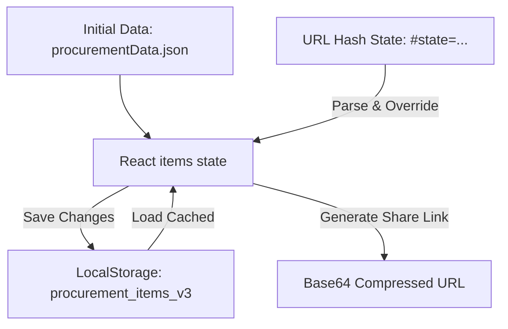

# System Architecture (สถาปัตยกรรมระบบ)
**ระบบตรวจสอบและรายงานพัสดุคอมพิวเตอร์ - เทศบาลนครนครสวรรค์**

ระบบถูกพัฒนาขึ้นในลักษณะ **Serverless Frontend Web Application (Single Page Application - SPA)** ซึ่งไม่ต้องการฐานข้อมูลฝั่งเซิร์ฟเวอร์แบบดั้งเดิม ช่วยลดการเปิดรับความเสี่ยงด้านความปลอดภัยของข้อมูล และไม่เสียค่าใช้จ่ายในการบำรุงรักษาโฮสติ้ง

## โครงสร้างเทคโนโลยี (Technology Stack)
* **Frontend Library:** [React 19.0.0](https://react.dev/)
* **Build Tool:** [Vite 8.1.1](https://vite.dev/)
* **CSS Framework:** [Tailwind CSS v4.3.3](https://tailwindcss.com/)
* **Icons Library:** [Lucide-React](https://lucide.dev/)
* **Excel Processing:** [SheetJS (XLSX) 0.18.5](https://sheetjs.com/)
* **Hosting:** [Firebase Hosting](https://firebase.google.com/docs/hosting)

## กลไกการจัดการสถานะข้อมูล (State Management & Persistence)

### 1. ฐานข้อมูลเริ่มต้น (Initial Database)
* เก็บข้อมูลพัสดุทั้ง 49 รายการไว้ที่ [procurementData.json](file:///d:/%E0%B8%A7%E0%B8%B1%E0%B8%AA%E0%B8%94%E0%B8%B8%E0%B8%84%E0%B8%AD%E0%B8%A1%2049%20%E0%B8%A3%E0%B8%B2%E0%B8%A2%E0%B8%81%E0%B8%B2%E0%B8%A3%20200769/src/data/procurementData.json) ในรูปแบบ Static JSON
* เมื่อเริ่มรัน หน้าเว็บจะโหลดไฟล์นี้มาแสดงและจัดประเภทโดยอัตโนมัติ

### 2. การบันทึกแคชภายในเครื่อง (LocalStorage Persistence)
* ทุกครั้งที่มีการเปลี่ยนสถานะพัสดุ (ผ่าน/ตรวจสอบ) หรือพิมพ์โน้ต ระบบจะอัปเดตลงบราวเซอร์ทันทีที่คีย์:
  * `procurement_items_v3`: บันทึกข้อมูลและสถานะล่าสุดของพัสดุ
  * `procurement_committee_v3`: บันทึกรายชื่อคณะกรรมการกรณีมีการอัปเดตหรือแก้ไขเพิ่มเติม

### 3. การส่งผ่านข้อมูลด้วย Hash URL (URL-based State Sharing)
* ออกแบบระบบคอมเพรสข้อมูลเพื่อให้กรรมการตรวจรับสามารถแชร์งานกันได้ผ่านการแปลงข้อมูลเป็น Base64
* **รูปแบบ URL:** `https://nsm-procurement-69.web.app#state=eyJjIjpb...`
* เมื่อบราวเซอร์อ่าน URL ที่มีพารามิเตอร์นี้ จะทำการแกะข้อมูลออกมาทับสถานะเริ่มต้นโดยอัตโนมัติ ทำให้ผู้รับลิงก์เห็นข้อมูลความคืบหน้าตรงกันกับผู้ส่ง 100%

### 4. การจัดการ Layout เพื่อพิมพ์เอกสาร (Print Layout Engine)
* ควบคุมการพิมพ์ด้วย CSS `@media print`
* เมื่อผู้ใช้สั่งพิมพ์ ระบบจะซ่อนตัวนำทาง ปุ่มตัวกรอง และปุ่มกดของรายงาน โดยจะแสดงผลเฉพาะหัวตารางรายงานรายละเอียดคุณลักษณะพัสดุ และแนบช่องลงลายมือชื่อของประธานกรรมการและกรรมการทั้ง 3 ท่านลงท้ายกระดาษตามมาตรฐานรายงานพัสดุหลวง

### 5. ทะเบียนหลายโครงการ (Multi-Project Registry)
* คีย์ `procurement_projects_registry_v1` เก็บรายชื่อโครงการ (`ProjectMeta[]`) และ `activeProjectId` ที่กำลังใช้งานอยู่
* ข้อมูลพัสดุ/คณะกรรมการ/ค่าตั้งค่าของแต่ละโครงการ ยังคงใช้โครงสร้าง (schema) เดิมทุกประการ เพียงแต่ namespaced ด้วย `projectId` ต่อท้ายคีย์เดิม (เช่น `procurement_items_v4__<projectId>`)
* แม่แบบตรวจรับ (Templates) ยังคงเป็นทรัพยากรกลางที่ใช้ร่วมกันได้ทุกโครงการ ไม่ผูกกับโครงการใดโครงการหนึ่ง
* การอัปเกรดจากข้อมูลชุดเดียวเดิม (v4) ไปเป็นทะเบียนหลายโครงการ เกิดขึ้นอัตโนมัติครั้งเดียวตอนโหลดแอปครั้งแรก โดยคีย์ข้อมูลเดิมจะไม่ถูกลบทิ้ง เพื่อให้กู้คืนได้เสมอ
