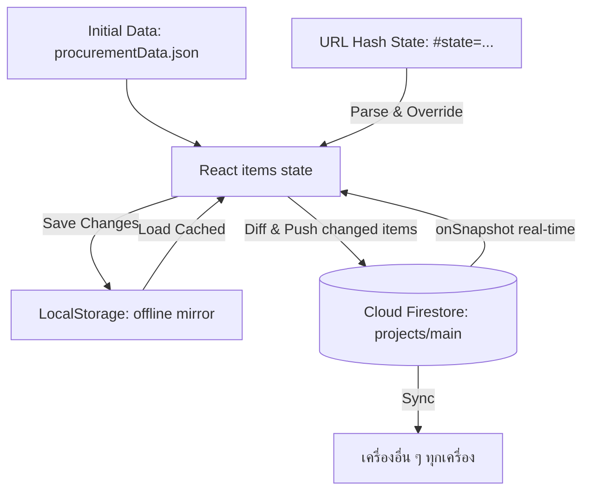

# System Architecture (สถาปัตยกรรมระบบ)
**ระบบตรวจสอบและรายงานพัสดุคอมพิวเตอร์ - เทศบาลนครนครสวรรค์**

ระบบถูกพัฒนาขึ้นในลักษณะ **Serverless Frontend Web Application (Single Page Application - SPA)** โดยใช้ **Cloud Firestore เป็นฐานข้อมูลกลางร่วมกันทุกเครื่อง** และใช้ LocalStorage เป็นแคชออฟไลน์ ไม่มีเซิร์ฟเวอร์แอปพลิเคชันที่ต้องดูแลเอง

## โครงสร้างเทคโนโลยี (Technology Stack)
* **Frontend Library:** [React 19.0.0](https://react.dev/)
* **Build Tool:** [Vite 8.1.1](https://vite.dev/)
* **CSS Framework:** [Tailwind CSS v4.3.3](https://tailwindcss.com/)
* **Icons Library:** [Lucide-React](https://lucide.dev/)
* **Excel Processing:** [SheetJS (XLSX) 0.18.5](https://sheetjs.com/)
* **Database:** [Cloud Firestore](https://firebase.google.com/docs/firestore) (real-time sync + offline persistence)
* **Hosting:** [Firebase Hosting](https://firebase.google.com/docs/hosting)

## กลไกการจัดการสถานะข้อมูล (State Management & Persistence)

```mermaid
graph TD
    A[Initial Data: procurementData.json] --> B[React items state]
    C[URL Hash State: #state=...] -->|Parse & Override| B
    D[LocalStorage: offline mirror] -->|Load Cached| B
    B -->|Save Changes| D
    F[(Cloud Firestore: projects/main)] -->|onSnapshot real-time| B
    B -->|Diff & Push changed items| F
    F -->|Sync| G[เครื่องอื่น ๆ ทุกเครื่อง]
```

### 1. ฐานข้อมูลเริ่มต้น (Initial Database)
* เก็บข้อมูลพัสดุทั้ง 49 รายการไว้ที่ [procurementData.json](file:///d:/%E0%B8%A7%E0%B8%B1%E0%B8%AA%E0%B8%94%E0%B8%B8%E0%B8%84%E0%B8%AD%E0%B8%A1%2049%20%E0%B8%A3%E0%B8%B2%E0%B8%A2%E0%B8%81%E0%B8%B2%E0%B8%A3%20200769/src/data/procurementData.json) ในรูปแบบ Static JSON
* เมื่อเริ่มรัน หน้าเว็บจะโหลดไฟล์นี้มาแสดงและจัดประเภทโดยอัตโนมัติ

### 2. ฐานข้อมูลกลางบนคลาวด์ (Cloud Firestore — Single Source of Truth)
* โครงสร้างข้อมูลบน Firestore:
  * `projects/main` — เก็บรายชื่อคณะกรรมการ (`committee`) และค่าตั้งค่าโครงการ (`config`)
  * `projects/main/items/{itemId}` — **หนึ่งเอกสารต่อพัสดุหนึ่งรายการ** เพื่อให้กรรมการสองคนแก้คนละรายการพร้อมกันได้โดยไม่เขียนทับกัน
* `src/utils/cloudSync.js` เป็นตัวจัดการซิงก์ทั้งหมด:
  * รับข้อมูลเข้าแบบเรียลไทม์ด้วย `onSnapshot` — เครื่องอื่นแก้ปุ๊บ หน้าจอนี้เปลี่ยนปั๊บ ไม่ต้องรีเฟรช
  * ส่งข้อมูลออกแบบ **diff** (เขียนเฉพาะรายการที่เปลี่ยนจริง) ผ่าน `inspectionRepository.saveItems()` เดิม จึงไม่ต้องแก้จุดเรียกใช้เดิมทั้งระบบ
  * ตอนบูตจะอ่านข้อมูลจาก **เซิร์ฟเวอร์เท่านั้น** (`getDocsFromServer`) ก่อนเริ่มเขียน — ป้องกันไม่ให้แคชว่างของเครื่องใหม่ไปลบข้อมูลจริงบนคลาวด์
  * ถ้าคลาวด์ยังไม่มีข้อมูลเลย จะอัปโหลดข้อมูลจากเครื่องแรกที่เปิดขึ้นไปเป็นชุดตั้งต้น (ล็อกด้วย transaction กันอัปโหลดซ้อน)
* **สิทธิ์เข้าถึง:** กำหนดที่ [firestore.rules](file:///d:/%E0%B8%A7%E0%B8%B1%E0%B8%AA%E0%B8%94%E0%B8%B8%E0%B8%84%E0%B8%AD%E0%B8%A1%2049%20%E0%B8%A3%E0%B8%B2%E0%B8%A2%E0%B8%81%E0%B8%B2%E0%B8%A3%20200769/firestore.rules) — ปัจจุบันเปิดให้ผู้ที่มีลิงก์อ่าน/เขียนได้ (จำกัดเฉพาะ path `projects/main`)

### 2.1 การบันทึกแคชภายในเครื่อง (LocalStorage Mirror)
* LocalStorage **ไม่ใช่แหล่งข้อมูลหลักอีกต่อไป** แต่ทำหน้าที่เป็นสำเนาออฟไลน์ เพื่อให้เปิดแอปได้ทันทีระหว่างรอเชื่อมต่อ และใช้งานต่อได้เมื่อเน็ตหลุด
  * `procurement_items_v4__<projectId>`: สำเนาข้อมูลและสถานะล่าสุดของพัสดุ
  * `procurement_committee_v4__<projectId>`: สำเนารายชื่อคณะกรรมการ
  * `procurement_pre_cloud_backup_v1`: สแนปช็อตข้อมูลในเครื่องก่อนรับข้อมูลจากคลาวด์ครั้งแรก (กันข้อมูลหายถาวร)
* Firestore เปิด `persistentLocalCache` (IndexedDB) ไว้ด้วย จึงรองรับการใช้งานหลายแท็บและออฟไลน์เต็มรูปแบบ

### 3. การส่งผ่านข้อมูลด้วย Hash URL (URL-based State Sharing)
* ออกแบบระบบคอมเพรสข้อมูลเพื่อให้กรรมการตรวจรับสามารถแชร์งานกันได้ผ่านการแปลงข้อมูลเป็น Base64
* **รูปแบบ URL:** `https://nsm-procurement-69.web.app#state=eyJjIjpb...`
* เมื่อบราวเซอร์อ่าน URL ที่มีพารามิเตอร์นี้ จะทำการแกะข้อมูลออกมาทับสถานะเริ่มต้นโดยอัตโนมัติ ทำให้ผู้รับลิงก์เห็นข้อมูลความคืบหน้าตรงกันกับผู้ส่ง 100%

### 4. การจัดการ Layout เพื่อพิมพ์เอกสาร (Print Layout Engine)
* ควบคุมการพิมพ์ด้วย CSS `@media print`
* เมื่อผู้ใช้สั่งพิมพ์ ระบบจะซ่อนตัวนำทาง ปุ่มตัวกรอง และปุ่มกดของรายงาน โดยจะแสดงผลเฉพาะหัวตารางรายงานรายละเอียดคุณลักษณะพัสดุ และแนบช่องลงลายมือชื่อของประธานกรรมการและกรรมการทั้ง 3 ท่านลงท้ายกระดาษตามมาตรฐานรายงานพัสดุหลวง

### 5. ทะเบียนหลายโครงการ (Multi-Project Registry)
* คีย์ `procurement_projects_registry_v1` เก็บรายชื่อโครงการ (`ProjectMeta[]`) และ `activeProjectId` ที่กำลังใช้งานอยู่
* ข้อมูลพัสดุ/คณะกรรมการ/ค่าตั้งค่าของแต่ละโครงการ ยังคงใช้โครงสร้าง (schema) เดิมทุกประการ เพียงแต่ namespaced ด้วย `projectId` ต่อท้ายคีย์เดิม (เช่น `procurement_items_v4__<projectId>`)
* แม่แบบตรวจรับ (Templates) ยังคงเป็นทรัพยากรกลางที่ใช้ร่วมกันได้ทุกโครงการ ไม่ผูกกับโครงการใดโครงการหนึ่ง
* การอัปเกรดจากข้อมูลชุดเดียวเดิม (v4) ไปเป็นทะเบียนหลายโครงการ เกิดขึ้นอัตโนมัติครั้งเดียวตอนโหลดแอปครั้งแรก โดยคีย์ข้อมูลเดิมจะไม่ถูกลบทิ้ง เพื่อให้กู้คืนได้เสมอ
