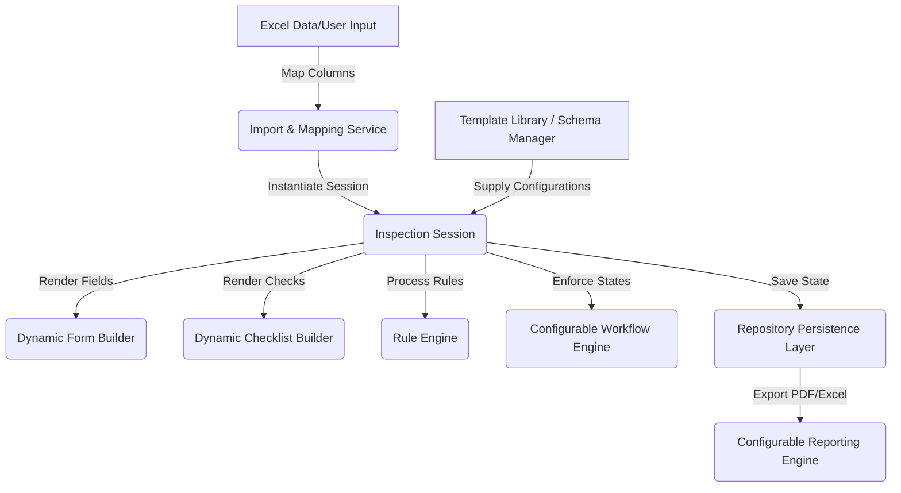
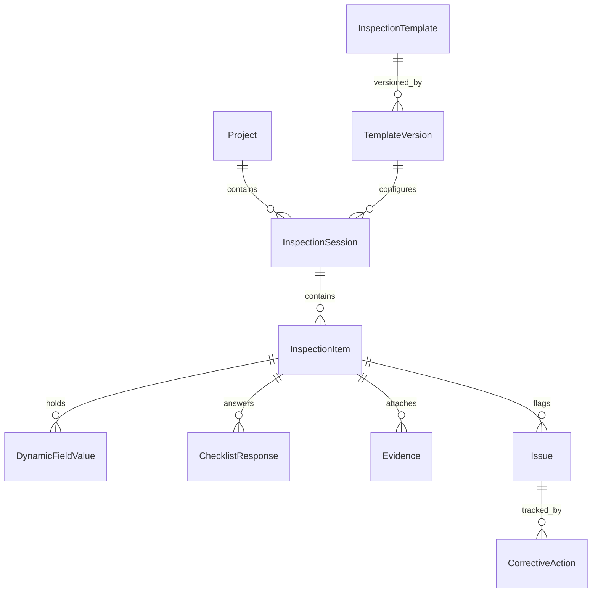
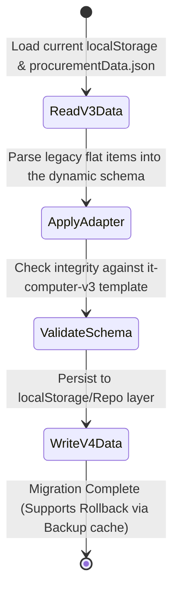
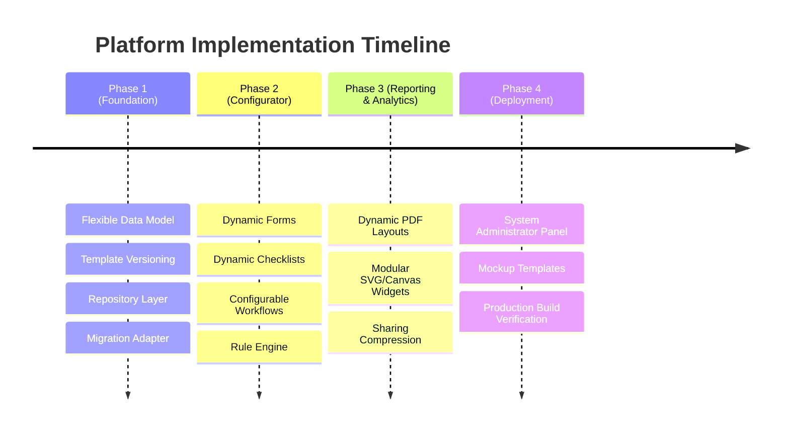

# Implementation Plan: Configurable Government Multi-Inspection Platform

This document presents the gap analysis, system architecture, data models, schemas, and implementation strategy to transform the current Nakhon Sawan Municipality procurement platform into a **Configurable Multi-Inspection Platform** capable of supporting any type of inspection project (IT, office supplies, services, construction, software, etc.) without source code modifications.

---

## 1. Gap Analysis

| Feature Area | Current Architecture | Proposed Configurable Platform |
| :--- | :--- | :--- |
| **Project / Item Types** | Fixed schema representing IT/computer procurement items. | Dynamic templates (InspectionTemplate) define item attributes. |
| **Checklists** | Hardcoded set of 8 checklist checkboxes (`qty_correct`, `model_matches`, etc.). | Dynamic checklist definitions allowing customizable checks, weights, and input types. |
| **Workflows** | Hardcoded three-state check: `passed`, `failed`, or `pending`. | Configurable state machine supporting Custom States, Transitions, and Role checks. |
| **Validation Rules** | Hardcoded Javascript logic for passing inspections (e.g. require all checklist items). | JSON Schema-based Rule Engine mapping checks to transitions. |
| **Data Fields** | Hardcoded fields: `serial_number`, `mac_address`, `asset_number`, `images`. | Dynamic forms rendering fields based on template definitions. |
| **Evidence** | Hardcoded 5-image attachment slots (`product`, `serial`, `asset_plate`, `box`, `accessories`). | Configurable evidence slots (PDF, GPS, video, signature, images) per template. |
| **Reports** | Hardcoded PDF layouts, signatures, and printing structures. | Report templates defining printable columns, headers, signature paths, and layouts. |
| **Version Control** | No versioning. Modifying files overwrites local items. | Template Versioning (V1.0, V1.1...) ensuring old records stay intact. |

---

## 2. Proposed Platform Architecture

The system uses a **metadata-driven design** where components do not execute code specific to any project. Instead, they interpret an `InspectionTemplate` schema.



---

## 3. Entity Relationship Diagram (ERD)



---

## 4. Schemas & Metadata Configurations

### 4.1 Template Schema (`TemplateVersion`)
```json
{
  "templateId": "it-computer-v3",
  "name": "ครุภัณฑ์คอมพิวเตอร์และอุปกรณ์พ่วง",
  "version": "1.0.0",
  "description": "แบบตรวจรับคอมพิวเตอร์และอุปกรณ์ต่อพ่วงสเปก TOR ของกองยุทธศาสตร์",
  "fields": [
    {
      "key": "serial_number",
      "label": "หมายเลขเครื่อง (Serial Number)",
      "type": "text",
      "required": true,
      "helpText": "โปรดกรอกให้ตรงตามป้ายหลังเครื่องสินค้า"
    },
    {
      "key": "mac_address",
      "label": "หมายเลข MAC Address",
      "type": "text",
      "required": false,
      "condition": "item.category === 'connectivity'"
    }
  ],
  "checklist": [
    {
      "id": "chk_qty",
      "category": "ตรวจสภาพทั่วไป",
      "label": "จำนวนถูกต้องตรงใบส่งสินค้า",
      "required": true,
      "weight": 10
    }
  ],
  "evidence": [
    {
      "key": "img_product",
      "label": "ภาพถ่ายสินค้าจริง",
      "type": "image",
      "required": true
    },
    {
      "key": "pdf_warranty",
      "label": "ใบรับประกันสินค้า (PDF)",
      "type": "file",
      "required": false
    }
  ],
  "workflow": "standard-workflow-v1",
  "rules": "it-inspection-rules-v1"
}
```

### 4.2 Workflow Schema
```json
{
  "workflowId": "standard-workflow-v1",
  "states": {
    "draft": { "label": "ร่างรายงาน" },
    "inspecting": { "label": "อยู่ระหว่างตรวจสอบ" },
    "returned": { "label": "ส่งกลับแก้ไข" },
    "approved": { "label": "ตรวจผ่านเรียบร้อย" }
  },
  "transitions": [
    {
      "from": "draft",
      "to": "inspecting",
      "role": "Procurement Officer",
      "action": "ส่งตรวจ"
    },
    {
      "from": "inspecting",
      "to": "approved",
      "role": "Committee Member",
      "action": "อนุมัติผล",
      "condition": "rules.allChecklistsPassed"
    }
  ]
}
```

### 4.3 Rule Schema
```json
{
  "rulesId": "it-inspection-rules-v1",
  "rules": [
    {
      "id": "require_serial_image",
      "condition": "item.serial_number !== '' && !item.images.serial",
      "action": "block_transition",
      "targetState": "approved",
      "message": "กรุณาอัปโหลดรูปป้าย Serial Number ก่อนทำการอนุมัติผ่าน"
    }
  ]
}
```

---

## 5. Permission Model (RBAC)

The system defines 4 central roles with permission levels:

1.  **System Administrator:** Create templates, modify schemas, configure validation rules, manage workflows.
2.  **Procurement Officer:** Import Excel sheets, instantiate inspection sessions, log initial data, raise issues.
3.  **Inspection Committee:** Access inspection items, perform checks, upload photographs, transition states.
4.  **Executive Viewer:** Access dashboard analytics, print official reports, review logs.

---

## 6. Migration Plan



*   **Rollback Strategy:** The migration script stores a backup of `procurement_items_v3` inside `procurement_items_v3_backup` in localStorage before committing the migrated state. In case of errors, the system automatically rolls back.

---

## 7. Phase-by-Phase Roadmap



---

## 8. Open Questions & Design Decisions

### User Input Required

> [!NOTE]
> **1. Storage Mechanism for Dynamic Attachments:**
> Since we use local storage, custom base64-encoded files (especially heavy documents like PDFs or videos) may quickly exceed the 5MB browser localStorage limit. Should we enforce a file compression rule, or advise keeping files below 1MB?
>
> **2. Initial Selection on Creation:**
> When the user initializes a new inspection session, they will select from 4 default templates:
> *   💻 ครุภัณฑ์คอมพิวเตอร์ (IT Equipment)
> *   📦 วัสดุสำนักงาน (Office Supplies)
> *   🛠️ งานบริการบำรุงรักษา (Services & SLA)
> *   🚧 งวดงานก่อสร้าง (Construction Milestones)
>
> Do these 4 templates align with the municipality's requirements?
