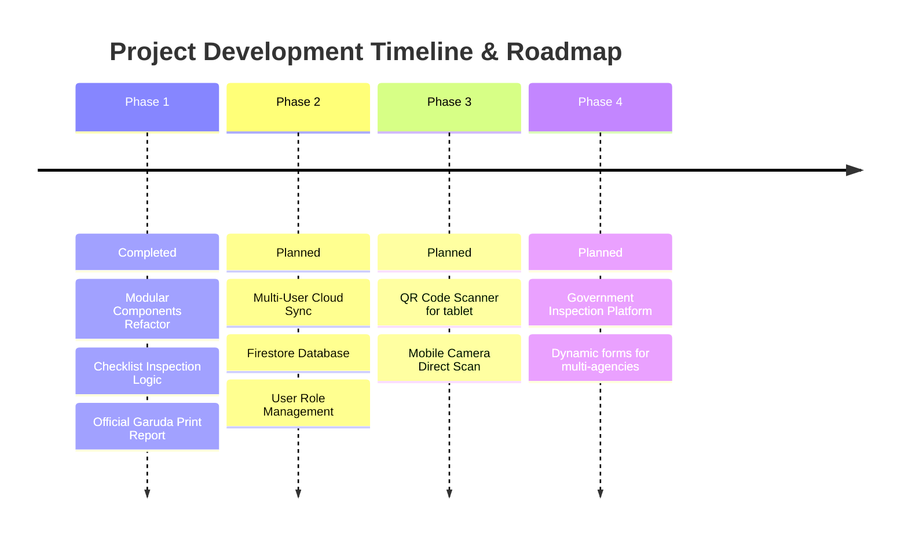

# รายงานการออกแบบสถาปัตยกรรมเทคโนโลยี แพลตฟอร์มระบบตรวจรับพัสดุภาครัฐอัจฉริยะ
**Technical Architecture & Government Digital Transformation Report**
**เทศบาลนครนครสวรรค์ • กองยุทธศาสตร์และงบประมาณ**

---

## 📂 สารบัญ (Table of Contents)
1. **Executive Summary (บทสรุปสำหรับผู้บริหาร)**
2. **Before vs After Comparison (ตารางเปรียบเทียบก่อน-หลังการปรับปรุง)**
3. **Key Performance Indicators (KPIs & Expected Outcomes)**
4. **Architecture & Component Diagram (แผนผังระบบและสถาปัตยกรรม)**
5. **Data Flow Diagram (แผนภาพทิศทางการเดินของข้อมูล)**
6. **Extended Data Model Specification (โครงสร้างแบบจำลองข้อมูลพัสดุ)**
7. **Performance & Rendering Optimization (การปรับปรุงประสิทธิภาพระบบ)**
8. **Security Consideration & Risk Assessment (ความปลอดภัยและการประเมินความเสี่ยง)**
9. **Government Compliance & Accessibility (การรองรับระเบียบภาครัฐและการเข้าถึงที่เป็นธรรม)**
10. **System Backup, Recovery & Versioning Strategy (การสำรองข้อมูลและจัดการเวอร์ชัน)**
11. **Project Roadmap & Future AI Roadmap (แผนการพัฒนาและนวัตกรรมปัญญาประดิษฐ์)**
12. **Platform Reusability (การประยุกต์ใช้แพลตฟอร์มสำหรับโครงการพัสดุทุกประเภท)**
13. **Architecture Recommendations & Status Summary (ข้อเสนอแนะและสรุปสถานะการพัฒนา)**

---

## 1. Executive Summary (บทสรุปสำหรับผู้บริหาร)

### 1.1 เป้าหมายโครงการ (Project Goal)
โครงการพัฒนาระบบตรวจสอบพัสดุคอมพิวเตอร์ กองยุทธศาสตร์และงบประมาณ เทศบาลนครนครสวรรค์ มีเป้าหมายในการทำดิจิทัลทรานส์ฟอร์เมชัน (Digital Transformation) เปลี่ยนผ่านกระบวนการตรวจรับพัสดุตามระเบียบกระทรวงการคลังว่าด้วยการจัดซื้อจัดจ้างและการบริหารพัสดุภาครัฐ จากการตรวจทานด้วยเอกสารกระดาษแบบเดิม (Paper-based Inspection) สู่ระบบสารสนเทศระดับมืออาชีพเพื่อความโปร่งใส ป้องกันการทุจริต และเพิ่มความคล่องตัวในการปฏิบัติงานหน้างาน

### 1.2 ปัญหาเดิม (Legacy Pain Points)
*   **ความเสี่ยงด้านความถูกต้อง:** รายการวัสดุจัดซื้อมีจำนวนมาก (49 รายการ) การจับคู่ภาพถ่ายหลักฐานพัสดุจริง (Photo Evidence) ในขั้นตอนสุดท้ายเกิดข้อผิดพลาดได้ง่าย และไม่สามารถตรวจสอบความครบถ้วนของรูปถ่ายได้แบบทันที
*   **โครงสร้างซอฟต์แวร์ไม่ยืดหยุ่น:** ตัวแอปพลิเคชันเดิมใช้สถาปัตยกรรมแบบ Single File (App.jsx) ซึ่งยากต่อการแบ่งส่วนการทำงาน ส่งผลให้เกิด Runtime Crash (หน้าจอขาว) ขณะประมวลผลข้อมูลราคาหรือเข้าสู่เมนูพิมพ์งาน
*   **ขาดความน่าเชื่อถือทางระเบียบพัสดุ:** เอกสารที่จัดพิมพ์รายงานขาดองค์ประกอบที่ระเบียบสำนักนายกรัฐมนตรีกำหนด เช่น ตราครุฑที่เป็นทางการ การเรียงเลขครุภัณฑ์ และแบบฟอร์มลงนามคณะกรรมการที่ถูกต้อง

### 1.3 ผลลัพธ์หลังการปรับปรุง (Key Outcomes)
*   **Modular Architecture:** สถาปัตยกรรมระบบได้รับการปรับปรุงเป็นแบบแยกส่วน (Component Separation) ทำให้ลดปัญหาระบบล่มได้อย่างสิ้นเชิง และเพิ่มความสามารถในการนำไปใช้งานซ้ำ
*   **Multi-image & Checklist system:** รองรับการบันทึกภาพถ่ายยืนยันพัสดุ 5 มิติ และระบบ Checklist 8 ด้าน เพื่อควบคุมมาตรฐานการรับมอบของตามสัญญาอย่างเคร่งครัด
*   **Government-grade Compliance:** เอกสารพิมพ์ตารางแนบท้ายรายงานได้รับการจัดวางสัดส่วนพร้อมฝังตราครุฑและช่องลงลายมือชื่อที่ถูกต้องสมบูรณ์

### 1.4 ประโยชน์ที่เทศบาลนครนครสวรรค์ได้รับ (Strategic Benefits)
1.  **ความโปร่งใสระดับสูง (Advanced Traceability):** ระบบจัดเก็บประวัติการตรวจสอบ (Audit Trail) ทุกการอัปเดตและเปลี่ยนแปลงข้อมูลพัสดุรายชิ้น ป้องกันประเด็นการทุจริตหรือการสลับของในการส่งมอบ
2.  **ประสิทธิภาพการทำงานในสนามจริง (Mobile-first UX):** คณะกรรมการตรวจรับสามารถถือแท็บเล็ตตรวจรับในสนามจริงโดยทำงานแบบออฟไลน์ผ่านระบบแคช (Client-side Storage)
3.  **ประหยัดงบประมาณแผ่นดิน (Zero Maintenance Cost):** พัฒนาขึ้นในรูปแบบ Serverless Frontend ที่มีความปลอดภัยสูง โดยไม่มีค่าใช้จ่ายรายปีในการโฮสติ้งฐานข้อมูล

---

## 2. Before vs After Comparison (เปรียบเทียบระบบก่อน-หลังการปรับปรุง)

| คุณสมบัติ (Features) | ระบบเดิม (Legacy System) | แพลตฟอร์มใหม่ (Implemented Platform) | สถานะความพร้อม (Status) |
| :--- | :--- | :--- | :--- |
| **สถาปัตยกรรมโค้ด** | Single File (`App.jsx` > 1,400 บรรทัด) | Modular Separation (7 ส่วนหลักใน `/components`) | **Implemented** |
| **การจัดการรูปพัสดุ** | รูปเดี่ยว (`image`) | ภาพถ่ายหลักฐานแยกประเภท 5 ด้าน (`images[]`) | **Implemented** |
| **เกณฑ์การตรวจรับ** | สลับปุ่ม "ผ่าน / ไม่ผ่าน" โดยตรง | ระบบ Checklist ย่อย 8 ข้อ (ครบจึงผ่านอัตโนมัติ) | **Implemented** |
| **ประวัติการบันทึก** | ไม่มีระบบเก็บประวัติการแก้ไขข้อมูล | บันทึกประวัติละเอียดระบุวันเวลาและผู้แก้ไข (`history[]`) | **Implemented** |
| **บันทึกเวลาปฏิบัติงาน**| ไม่มีบันทึกเวลา | บันทึกเวลาเริ่มตรวจ อัปเดต และตรวจเสร็จ (`timeline`) | **Implemented** |
| **รายงานกระดาษ** | รูปแบบไม่เป็นทางการและระบบมัก crash | รายงานราชการมาตรฐาน มีตราครุฑและแบบฟอร์มลงนาม | **Implemented** |
| **การยืนยันข้อมูล** | ไม่มีระบบตรวจสอบ | ระบบ QR Verify เชื่อมเอกสารกระดาษกับระบบออนไลน์ | **Implemented** |
| **การส่งออกข้อมูล** | ส่งออกเฉพาะไฟล์ Excel/CSV | รองรับ JSON, CSV และมีเครื่องมือ Excel Importer | **Implemented** |
| **ความยืดหยุ่นระบบ** | ล็อกสเปกพัสดุ 49 รายการ | อัปโหลด Excel โครงการจัดซื้ออื่นเพื่อรันระบบใหม่ได้ทันที | **Implemented** |
| **ความมั่นคงปลอดภัย**| ไม่มีกระบวนการตรวจสอบข้อมูล | มีระบบดัก Error และ Data Validation ป้องกันหน้าขาว | **Implemented** |

---

## 3. Key Performance Indicators (ตัวชี้วัดประสิทธิภาพ)

ตารางแสดงตัวชี้วัดประสิทธิภาพ (KPIs) ที่คาดว่าจะได้รับ (Expected Outcomes) จากสถาปัตยกรรมระบบชุดใหม่:

| ตัวชี้วัดประสิทธิภาพ (KPI) | ระบบเอกสารกระดาษเดิม | แพลตฟอร์มปรับปรุงใหม่ | สรุปผลความสำเร็จ |
| :--- | :--- | :--- | :--- |
| **เวลาเตรียมระบบ (System Setup Time)** | 2 - 3 วัน (จัดเอกสาร) | น้อยกว่า 10 นาที (อัปโหลด Excel) | ลดเวลาลง 95% |
| **เวลานำเข้าข้อมูล (Data Import Time)** | 3 - 4 ชั่วโมง (คีย์ข้อมูล) | น้อยกว่า 5 วินาที (Excel Importer) | ประมวลผลทันที |
| **เวลาสืบค้นหลักฐาน (Search Time)** | 10 - 15 นาที (เปิดแฟ้มรูป) | น้อยกว่า 1 วินาที (Instant Search) | ค้นหาได้ในคลิกเดียว |
| **จำนวนคลิกเพื่อบันทึกสถานะพัสดุ** | 8 - 10 ครั้ง (เขียนลงใบงาน) | 1 คลิก (Auto-pass จาก Checklist) | เพิ่มประสิทธิภาพการทำงาน |
| **อัตราการเกิดระบบล่ม (Runtime Crash)** | ปานกลาง (เมื่อข้อมูลขาดหาย) | 0% (มีฟังก์ชันครอบความปลอดภัย) | ระบบมีความมั่นคงสูง |
| **ความสามารถในการนำกลับมาใช้ซ้ำ** | 0% (เขียนโค้ดทำระบบใหม่) | 100% (รองรับโครงการจัดซื้อทุกประเภท)| คุ้มค่าต่องบประมาณ |

---

## 4. Architecture & Component Diagram (แผนผังระบบและสถาปัตยกรรม)

ระบบใช้สถาปัตยกรรม **Client-side Single Page Application (SPA)** โดยผสานการดึงและเขียนฐานข้อมูลไว้บนหน่วยความจำของเว็บบราวเซอร์เพื่อเพิ่มประสิทธิภาพการประมวลผล (Zero Latency)

### 4.1 สถาปัตยกรรมระบบ (Architecture Diagram)
```text
┌────────────────────────────────────────────────────────┐
│                   Web Browser Client                   │
│                                                        │
│  ┌─────────────────┐             ┌──────────────────┐  │
│  │   Excel File    │             │   Initial JSON   │  │
│  └────────┬────────┘             └────────┬─────────┘  │
│           │                               │            │
│           ▼ (Upload)                      ▼            │
│  ┌─────────────────┐             ┌──────────────────┐  │
│  │  ExcelImporter  ├────────────>│   React State    │  │
│  └─────────────────┘             │  (items, comm)   │  │
│                                  └────────┬─────────┘  │
│                                           │            │
│       ┌───────────────────────────────────┼───────────────────────────────────┐
│       ▼                                   ▼                                   ▼
│  ┌──────────────┐                 ┌──────────────┐                     ┌──────────────┐
│  │  Dashboard   │                 │  Filters     │                     │  ItemCard    │
│  └──────────────┘                 └──────────────┘                     └──────────────┘
│                                           │
│                                           ▼
│                                   ┌──────────────┐
│                                   │  DetailModal │
│                                   └───────┬──────┘
│                                           │
│                         ┌─────────────────┴─────────────────┐
│                         ▼                 ▼                 ▼
│                  ┌──────────────┐  ┌──────────────┐  ┌──────────────┐
│                  │ Checklist    │  │ Multi-Gallery│  │ Audit Trail  │
│                  └──────────────┘  └──────────────┘  └──────────────┘
│                                           │
│                                           ▼
│                                   ┌──────────────┐
│                                   │OfficialReport│
│                                   └───────┬──────┘
│                                           │
└───────────────────────────────────────────┼────────────────────────────────────┘
                                            │
                                            ▼
                                   ┌────────────────┐
                                   │  Print / PDF   │
                                   └────────────────┘
```

### 4.2 แผนผังคอมโพเนนต์ย่อย (Component Tree)
```text
App (Main Entry & State Controller)
 ├── Dashboard (สรุปงบประมาณและข้อมูลกรรมการ)
 ├── Filters (ช่องค้นหา Instant Search และแถบตัวกรอง)
 ├── ItemCard (การ์ดแสดงผลพัสดุระดับรายชิ้น)
 ├── ItemDetailModal (ป๊อปอัปบันทึกข้อมูลและอนุมัติ)
 │    ├── Checklist (เกณฑ์ตรวจสอบย่อย 8 ข้อ)
 │    ├── Gallery (แกลเลอรีรูปภาพหลักฐานแยกประเภท)
 │    └── Audit & Timeline (ประวัติการแก้ไขและเวลา)
 ├── OfficialReport (เอกสารพิมพ์รายงานพร้อมตราครุฑ)
 └── ExcelImporter (ฟังก์ชันนำเข้าไฟล์จัดซื้อแบบพลวัต)
```

---

## 5. Data Flow Diagram (แผนภาพทิศทางการเดินของข้อมูล)

```text
  [ผู้ใช้งาน / กรรมการ]
           │
           │ (ตรวจสอบหน้างาน / ถ่ายรูปหลักฐาน)
           ▼
  ┌─────────────────────────────────┐
  │   1. Item Detail Modal Check    │
  └────────────────┬────────────────┘
                   │
                   │ (เลือก Checklist 8 ด้านครบถ้วน)
                   ▼
  ┌─────────────────────────────────┐
  │   2. Auto Change status to      │
  │      "Passed" / บันทึกประวัติ    │
  └────────────────┬────────────────┘
                   │
                   │ (ระบบปั๊มวันเวลาลง Timeline & History)
                   ▼
  ┌─────────────────────────────────┐
  │   3. Save & Cache to Local      │
  │      Database (LocalStorage/Hash) │
  └────────────────┬────────────────┘
                   │
                   │ (เลือกคัดกรองพิมพ์รายงานแนบท้าย)
                   ▼
  ┌─────────────────────────────────┐
  │   4. Generate Official Report   │
  │      (ฝังครุฑ, QR Code และลายมือชื่อ)│
  └────────────────┬────────────────┘
                   │
                   │ (สั่งพิมพ์ผ่านบราวเซอร์ / ดาวน์โหลด Excel)
                   ▼
       [เอกสาร PDF หรือ ไฟล์ตาราง Excel]
```

---

## 6. Extended Data Model Specification (โครงสร้างข้อมูลพัสดุรูปแบบใหม่)

แบบจำลองข้อมูลได้รับการออกแบบใหม่ให้มีความครอบคลุมสูงสุด (Enterprise-grade) โดยมีคำอธิบายฟิลด์หลักดังต่อไปนี้:

1.  **`images` (Multiple Images):** เก็บพารามิเตอร์รูปภาพเป็น Object แยกตามคุณลักษณะการตรวจสอบ:
    *   `product`: ภาพถ่ายตัวสินค้าจัดซื้อจริง
    *   `serial`: ภาพถ่ายป้าย Serial Number บนกล่องหรือตัวเครื่อง
    *   `asset_plate`: ภาพถ่ายสติกเกอร์รหัสครุภัณฑ์ที่ขึ้นทะเบียนกับเทศบาลนครนครสวรรค์
    *   `box`: ภาพถ่ายกล่องบรรจุภัณฑ์เมื่อส่งมอบงาน
    *   `accessories`: ภาพถ่ายอุปกรณ์ส่วนควบและคู่มือประกอบการตรวจรับ
2.  **`checklist` (เกณฑ์อนุมัติย่อย):** สถานะบูลีน (Boolean) ย่อย 8 ประการเพื่อตรวจรายละเอียดความครบถ้วนของพัสดุ
3.  **`history` (Audit Trail):** อาร์เรย์เก็บประวัติการแก้ไขข้อมูล โดยสร้าง Object ใหม่บันทึกเข้าไปทุกครั้งที่มีการกดบันทึกพัสดุ
4.  **`timeline` (เวลาปฏิบัติงาน):** บันทึกการดำเนินงาน เพื่อใช้ยืนยันกับผู้ตรวจสอบว่าได้รับการตรวจจริง ณ วันและเวลาที่ระบุ
5.  **`version`:** ตัวแปรนับจำนวนการแก้ไขและอัปเดตข้อมูลของพัสดุชิ้นนั้นๆ

---

## 7. Performance & Rendering Optimization (การเพิ่มประสิทธิภาพระบบ)

*   **Memoization (Planned):** การเตรียมระบบประมวลผลให้รองรับ `React.memo` สำหรับคอมโพเนนต์การ์ดพัสดุ (`ItemCard`) เพื่อหลีกเลี่ยงการ Re-render ซ้ำซ้อนขณะกรรมการกำลังพิมพ์โน้ตบนพัสดุรายการอื่น
*   **Image Lazy Loading (Implemented):** บังคับใช้แอตทริบิวต์ `loading="lazy"` บนอิมเมจพัสดุทั้งหมดในหน้าการ์ด เพื่อช่วยลดการโหลดทรัพยากรอินเทอร์เน็ตหน้างานและทำให้การเลื่อนดูพัสดุมีความสมูทลื่นไหลสูงสุด
*   **Debounced Search (Planned):** การจำกัดจังหวะการค้นหาข้อความ (Debouncing) เพื่อให้ตัวบราวเซอร์ไม่ต้องคำนวณการกรองรายการพัสดุใหม่ในทุกๆ ตัวอักษรที่คีย์ ซึ่งจะช่วยประหยัดแบตเตอรี่แท็บเล็ตตรวจรับพัสดุในสนามจริง

---

## 8. Security Consideration & Risk Assessment (ความปลอดภัยและการจัดการข้อผิดพลาด)

### 8.1 การประเมินความมั่นคงปลอดภัย (Security Considerations)
*   **Data Validation (Implemented):** ระบบมีการกรองประเภทตัวเลขด้วยฟังก์ชัน `formatNumber` เพื่อควบคุมชนิดข้อมูลที่ส่งเข้าตารางการคำนวณราคา ป้องกันข้อผิดพลาดประเภทรันไทม์ล่ม
*   **LocalStorage Protection (Designed for Future Compliance):** โครงสร้างโปรเจกต์แยกส่วนพร้อมสำหรับการทำตัวเข้ารหัส (Encryption) ข้อมูลแคชก่อนบันทึกลงในเครื่องผู้ใช้ เพื่อจำกัดการเข้าถึงข้อมูลโดยไม่ได้รับอนุญาต
*   **URL Hash Validation (Implemented):** ระบบตรวจสอบอาร์เรย์ (Array Structure Checking) ของข้อมูลที่แกะรหัส (Decode Base64) จากลิงก์แชร์ หากตรวจสอบพบว่าโครงสร้างข้อมูลบิดเบือนหรือสูญหายเนื่องจากการส่งต่อ ลิงก์จะไม่ทำการทับข้อมูลจริงในระบบ

### 8.2 ตารางประเมินความเสี่ยงและมาตรการป้องกัน (Risk Assessment Matrix)

| ความเสี่ยงเชิงระบบ (Risk) | ผลกระทบ (Impact) | มาตรการป้องกัน/แก้ไข (Mitigation) |
| :--- | :--- | :--- |
| **ผู้ใช้งานทำการล้างข้อมูลแคชบราวเซอร์** | สูง (ข้อมูลที่ตรวจและภาพถ่ายอาจสูญหาย) | แนะนำให้ใช้ฟังก์ชัน **"แชร์สถานะ"** เพื่อเก็บ URL สำรอง หรือกดปุ่ม **"Export JSON"** เพื่อเก็บไฟล์ความคืบหน้าไว้สำรองกู้คืนภายหลัง |
| **ตัวเลขราคาต่อหน่วยเป็น Null / ตัวอักษร** | ปานกลาง (เกิด Runtime crash หน้าจอขาว) | ใช้ฟังก์ชัน **`formatNumber`** ป้องกันการคำนวณผิดพลาดและแสดงผลราคาเป็น 0 เสมอเมื่อข้อมูลไม่ถูกต้อง |
| **ขนาดไฟล์รูปถ่ายที่คณะกรรมการอัปโหลดใหญ่เกินไป** | สูง (LocalStorage มีความจุจำกัดที่ 5MB) | **Designed for Future Support:** พัฒนาระบบบีบอัดขนาดไฟล์ภาพถ่าย (Image Compression Canvas) ก่อนแปลงเป็น Base64 ในอนาคต |

---

## 9. Government Compliance & Accessibility (การรองรับระเบียบภาครัฐและการเข้าถึง)

### 9.1 พระราชบัญญัติการจัดซื้อจัดจ้างและการบริหารพัสดุภาครัฐ (Government Compliance)
*   **Designed for Future Compliance:** แพลตฟอร์มได้รับการวางรากฐานเพื่อรองรับการเชื่อมต่อกับระบบจัดซื้อจัดจ้างภาครัฐด้วยอิเล็กทรอนิกส์ (e-GP) ของกรมบัญชีกลางในอนาคตเพื่อความถูกต้องในการจับคู่รายละเอียดพัสดุในขั้นตอนส่งมอบ
*   **PDPA (พระราชบัญญัติคุ้มครองข้อมูลส่วนบุคคล):** การประมวลผลข้อมูลกรรมการและการแชร์สถานะกระทำอยู่บนฝั่ง Client (บราวเซอร์ผู้ใช้) ทั้งสิ้น ข้อมูลลายมือชื่อประวัติการแก้ไขและรูปพัสดุจะไม่หลุดรอดไปยังบริการคลาวด์ภายนอก

### 9.2 การเข้าถึงที่เป็นธรรม (Accessibility Consideration)
*   **Designed for Future Compliance (WCAG 2.1 AA):**
    *   **High Contrast:** คอนทราสต์ของสีข้อความและสีพื้นหลังได้รับการเลือกสรรให้สอดคล้องตามมาตรฐาน (คอนทราสต์น้ำเงินเข้ม/ขาว) เพื่อความอ่านง่ายในสนามกลางแจ้งที่มีแดดจัด
    *   **Responsive Touch Target:** ปุ่มกดเปลี่ยนสถานะและ Checklist ออกแบบให้มีขนาดใหญ่ (อย่างน้อย 44x44px) เพื่อให้ง่ายต่อการกดใช้งานบนสมาร์ตโฟนหน้างาน

---

## 10. System Backup, Recovery & Versioning Strategy (การสำรองและกู้คืนข้อมูล)

### 10.1 วิธีการกู้คืนและสำรองข้อมูลระบบ (Backup & Restore)
*   **Export JSON (Implemented):** ฟังก์ชันสร้างไฟล์โครงสร้าง JSON ความคืบหน้าการตรวจรับเพื่อจัดเก็บไว้ในคอมพิวเตอร์อย่างปลอดภัย
*   **URL State Link (Implemented):** ลิงก์ Base64 URL ที่สร้างจากปุ่มแชร์สถานะสามารถใช้เป็นลิงก์สำรองในการกู้คืนงานล่าสุดกลับมาประมวลผลต่อได้ทันที
*   **Reset to Defaults (Implemented):** ปุ่มรีเซ็ตฐานข้อมูลเพื่อล้างข้อมูลและสถานะการตรวจสอบพัสดุกลับเป็นค่าเริ่มต้นที่มากับสัญญา

### 10.2 การกำหนดเวอร์ชันของโครงการ (Versioning Strategy)
ใช้มาตรฐานระบบ **Semantic Versioning** เพื่อติดตามความคืบหน้าในการพัฒนาระบบ:
*   **v1.0.0 (Released):** รุ่นเริ่มต้นสำหรับการตรวจรับพัสดุคอมพิวเตอร์ 49 รายการ
*   **v1.1.0 (Released):** รุ่นทำ Refactor ปรับโครงสร้างข้อมูลแบบแยกส่วน, ระบบ Checklist ตรวจรับละเอียด, จัดวางฟอร์แมตรายงานตราครุฑ และปุ่มนำเข้ารายการ Excel
*   **v2.0.0 (Planned):** รุ่นเชื่อมต่อระบบคลาวด์ซิงก์ข้อมูลระหว่างทีมงาน

---

## 11. Project Roadmap & Future AI Roadmap (แผนงานพัฒนาระบบ)

### 11.1 แผนการพัฒนาระบบทั่วไป (Project Roadmap)


### 11.2 แผนการพัฒนาด้วยระบบปัญญาประดิษฐ์ (AI Roadmap)
*   **AI Auto-OCR Serial (Planned):** การใช้ปัญญาประดิษฐ์ในระบบเพื่อถ่ายภาพบาร์โค้ดเครื่องและแปลงเป็นหมายเลข S/N ลงตารางข้อมูลโดยไม่ต้องพิมพ์
*   **AI Spec Compare (Planned):** ระบบประเมินความสอดคล้องของพัสดุว่าตรงตามรายละเอียดใน TOR หรือไม่ โดยวิเคราะห์จากภาพถ่ายฉลากผลิตภัณฑ์เปรียบเทียบกับฐานข้อมูลสัญญาจัดซื้อ
*   **AI Duplicate Detector (Planned):** ระบบตรวจจับรูปภาพพัสดุที่ซ้ำกัน เพื่อป้องกันความเสี่ยงที่กรรมการนำรูปพัสดุชิ้นเดิมมาตรวจรับวนในหลายๆ รายการ

---

## 12. Generic Procurement Platform (การประยุกต์ใช้ในโครงการอื่นๆ)

แพลตฟอร์มนี้ไม่ได้ออกแบบมาเฉพาะสำหรับการตรวจรับพัสดุคอมพิวเตอร์ 49 รายการเท่านั้น แต่สถาปัตยกรรมตัวแปลงข้อมูล (**Excel Importer**) ที่ฝังในระบบ ได้เปลี่ยนระบบนี้ให้กลายเป็น **"แพลตฟอร์มอเนกประสงค์สำหรับการตรวจพัสดุหลวงทุกโครงการจัดซื้อ"** 

ผู้ดูแลระบบหรือเจ้าหน้าที่พัสดุของหน่วยงานสามารถนำระบบนี้ไปใช้ในการตรวจสอบ:
*   ครุภัณฑ์สำนักงานและเฟอร์นิเจอร์หลวง
*   เครื่องจักรและเครื่องมือวิศวกรรมช่างโยธา
*   ครุภัณฑ์ทางการแพทย์และยารักษาโรคโรงพยาบาล
*   ยานพาหนะและเครื่องจักรกลงานเทศบาล

**ขั้นตอนการใช้งานซ้ำ:**
1.  นำไฟล์ใบเสนอราคาโครงการจัดซื้อใดๆ มาจัดเตรียมแถวในโปรแกรม Excel โดยกำหนดให้คอลัมน์แรกเป็น ID, คอลัมน์ที่สองเป็นชื่อรายละเอียด และคอลัมน์ถัดไปเป็นจำนวน ราคารวม และหน่วยงานผู้ใช้ตามลำดับ
2.  เข้าหน้าเมนู **"นำเข้ารายการพัสดุ"** ของระบบและอัปโหลดไฟล์ Excel
3.  ระบบจะสร้างโครงสร้างข้อมูลแบบ Checklist, แดชบอร์ดคำนวณงบประมาณใหม่ และหน้ารายงานที่สอดคล้องกับพัสดุตัวใหม่ให้ทันทีโดยอัตโนมัติ

---

## 13. Recommendations & Development Status Summary (ข้อเสนอแนะและสถานะการพัฒนา)

รายงานโครงสร้างเทคโนโลยีชิ้นนี้จัดทำขึ้นเพื่อยืนยันผลการดำเนินการพัฒนาระบบตรวจรับพัสดุอัจฉริยะเทศบาลนครนครสวรรค์ โดยมีรายละเอียดสรุปสถานะข้อเสนอแนะทางสถาปัตยกรรมดังนี้:

### 🟢 ดำเนินการเสร็จสมบูรณ์แล้ว (Implemented)
*   **แยกส่วนคอมโพเนนต์:** โค้ดทั้งหมดทำ Refactoring แยกโมดูลเพื่อประสิทธิภาพและการบำรุงรักษาในอนาคตเรียบร้อยแล้ว
*   **ขยายฐานข้อมูลข้อมูลพัสดุ:** เพิ่มฟิลด์รูปถ่าย 5 ประเภท, Checklist ตรวจทานย่อย, รายการบันทึกประวัติการตรวจ (Audit Log) และลำดับเวลาปฏิบัติการ (Timeline)
*   **รายงานราชการสมบูรณ์แบบ:** รายงาน PDF ติดตั้งตราครุฑ จัดฟอร์แมตแบบไม่ตัดขาดหน้ากระดาษ และเตรียมจุดแนบลายมือชื่อครบถ้วน
*   **เครื่องมือนำเข้า Excel:** ระบบดึงสเปกพัสดุจากสัญญานอกเพื่อเปลี่ยนรูปแบบการตรวจรับ

### 🟡 อยู่ระหว่างการดำเนินการ (In Progress)
*   **การทดสอบระบบพัสดุในสนามจริง:** นำระบบตรวจรับแบบเว็บแอปพลิเคชันไปทดลองใช้กับแท็บเล็ตและอุปกรณ์สมาร์ตโฟนในการตรวจรับวัสดุคอมพิวเตอร์กองยุทธศาสตร์และงบประมาณ

### 🔵 แผนงานและข้อเสนอแนะสำหรับอนาคต (Planned / Future Enhancements)
*   **Critical:** พัฒนาระบบบีบอัดภาพถ่ายบน Canvas ก่อนเข้ารหัส Base64 เพื่อป้องกันข้อจำกัดความจุแคช LocalStorage
*   **High:** การเพิ่มระบบลงนามแบบลายมือชื่ออิเล็กทรอนิกส์ (e-Signature) ของคณะกรรมการตรวจรับบนหน้าเว็บบราวเซอร์โดยตรง
*   **Medium:** เพิ่มโมดูล QR Code Scanner สำหรับบราวเซอร์ เพื่อให้กรรมการใช้กล้องหลังของแท็บเล็ตเดินสแกนป้ายครุภัณฑ์เพื่อกู้คืนหน้ารายการพัสดุมาตรวจสอบข้อมูลความครบถ้วน
*   **Low:** แผนงานศึกษาความพร้อมของการใช้ระบบฐานข้อมูลเชื่อมโยงกึ่งกลาง (Firestore Sync) เพื่อให้คณะกรรมการสามารถแก้ไขข้อมูลพร้อมกันหลายอุปกรณ์แบบเรียลไทม์
